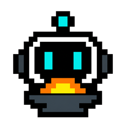

<p align="center">
  
</p>

# Open Game Forge

The **agent-first 2D game maker for the web**. Chat with an AI agent, watch it build your game, drag-edit anything, share via URL.

OGF's job is to be the visual half of an agent-driven workflow: you talk to Codex, the agent writes code + generates art + wires up scenes, OGF renders it all in a tabbed editor (assets / scenes / play) where you can tweak by clicking and dragging instead of writing more prompts.

## Status

**Pre-release. Active development on [`feature/js-first`](../../tree/feature/js-first).**

Currently usable for tower-defense and top-down arena games on Godot and vanilla-JS web targets. Side-scroller, RPG, and roguelike support is in progress (see [`docs/genre-support.md`](docs/genre-support.md)).

## Why OGF

There's no shortage of 2D game tools — Phaser Editor, GameMaker, Construct, RPG Maker, even Godot itself. They're all built around the assumption that **a human is the primary author** and the AI (if present) is a copilot.

OGF flips that. **The agent is the primary author**. The editor exists for the parts that are easier to drag than to describe — moving an enemy spawn, retiming a wave, swapping a sprite. Everything else stays in chat.

This isn't "Phaser Editor + AI." It's a different paradigm: Bolt.new for game dev. Replit for indie game makers. ChatGPT that ships you a playable web game.

## Quick start

Requires Node 20+, npm 10+, and `codex` CLI installed (`npm i -g @openai/codex`).

```bash
npm install
npm run dev
```

This starts:

- Daemon: <http://localhost:7621>
- Web:    <http://localhost:7620>

Open the web URL. The agent pill should turn green if Codex is detected. Open a folder, ask the agent to make a game, watch it build.

## Engine support

| Engine | Status | When to pick |
|--------|--------|--------------|
| **Web** (vanilla JS, soon Phaser) | **default** | Browser games, fast iteration, easy distribution |
| **Godot 4** | maintained, second-class | When you specifically want native binaries / Godot ecosystem |
| Unity | scaffolding only | Not actively developed |

Web is the path forward — see [`docs/roadmap.md`](docs/roadmap.md). Godot still works for existing projects; we just don't add new Godot features.

## Layout

```
open-game-forge/
├── packages/contracts/   # shared API / SSE types + SceneModel schemas
├── apps/daemon/          # Node.js + Express, spawns Codex
└── apps/web/             # Vite + React UI
```

## Documentation

- [`docs/architecture.md`](docs/architecture.md) — agent-first paradigm, OGF's design principles, what makes OGF different from Phaser Editor / GameMaker
- [`docs/roadmap.md`](docs/roadmap.md) — 12-month phased plan from JS-first pivot to public release
- [`docs/genre-support.md`](docs/genre-support.md) — matrix of which game genres OGF supports today + what's WIP

## License

TBD — pre-release, license-pending.

## Credits

The daemon-and-spawn pattern is adapted from [`nexu-io/open-design`](https://github.com/nexu-io/open-design).
