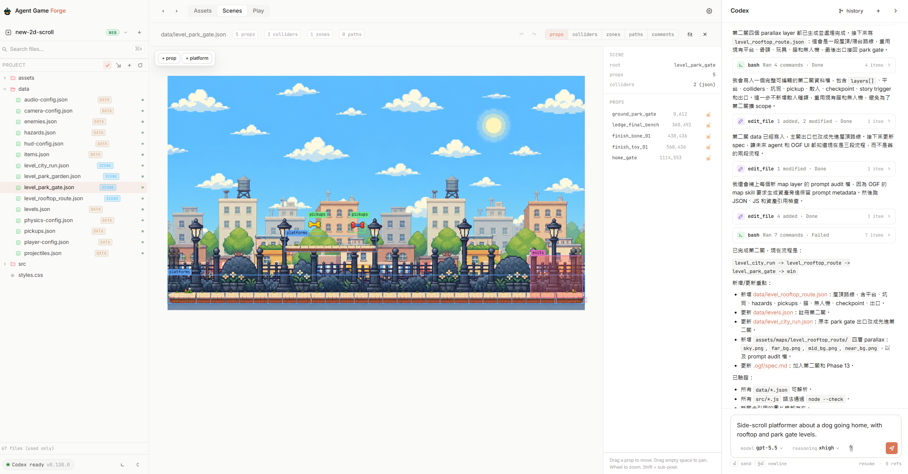
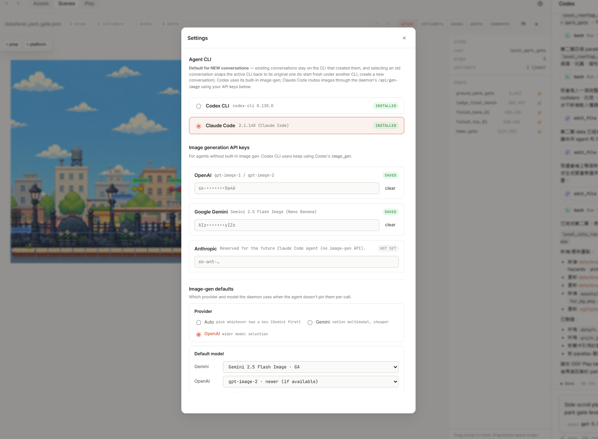
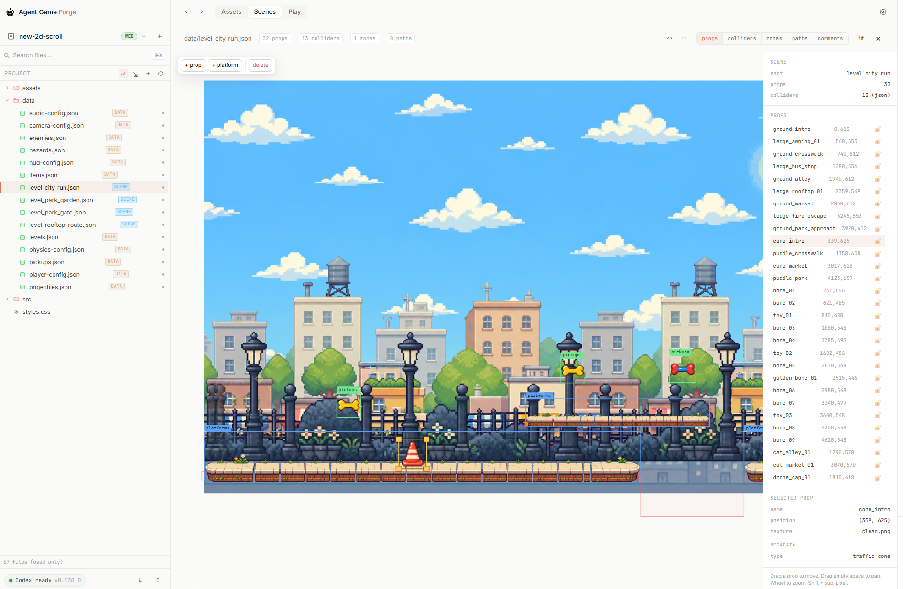

<p align="center">
  
</p>

<p align="center">
  <b>Локальна 2D-IDE для ігор з принципом bring-your-own-agent.</b><br/>
  Codex або Claude Code за кермом. Web сьогодні, Godot та Unity — у roadmap.
</p>

<p align="center">
  <a href="./README.md">English</a> ·
  <a href="./README.es.md">Español</a> ·
  <a href="./README.pt-BR.md">Português (Brasil)</a> ·
  <a href="./README.de.md">Deutsch</a> ·
  <a href="./README.fr.md">Français</a> ·
  <a href="./README.zh-CN.md">简体中文</a> ·
  <a href="./README.zh-TW.md">繁體中文</a> ·
  <a href="./README.ko.md">한국어</a> ·
  <a href="./README.ja.md">日本語</a> ·
  <a href="./README.ar.md">العربية</a> ·
  <a href="./README.ru.md">Русский</a> ·
  <b>Українська</b> ·
  <a href="./README.tr.md">Türkçe</a>
</p>

<p align="center">
  <a href="https://github.com/0x0funky/agent-game-forge/stargazers"></a>
  
  
  
</p>

---

Agent Game Forge (**AGF**) — це десктопна IDE з відкритим кодом, яка дозволяє ШІ-агенту з кодування зібрати для вас повноцінні 2D-ігри — спрайти, parallax-фони, фізику, небезпеки, предмети, розташування сцен — і надає візуальний редактор, щоб перетягуванням підправити те, що агент зробив не так. **Ви обираєте агента** (Codex CLI або Claude Code) і **ви обираєте модель зображень** (Gemini 2.5 Flash Image або OpenAI gpt-image-1). Сьогодні типовий вихідний формат — vanilla JS + Canvas (нульова прив'язка до фреймворку, запускається у будь-якому браузері); таргети рушіїв Godot 4 та Unity — у roadmap.

---

## ✨ Стисло

- 🤖 **Власний агент** — Codex CLI або Claude Code. Перемикання в Settings. На льоту.
- 🎨 **Пайплайн ассетів production-рівня** — хромакей sprite-листів, мульти-екшн анімації, parallax з 4 тайлованих шарів + despill — все першокласне, а не прикручене збоку.
- 🖼️ **Мульти-провайдерна генерація зображень** — Gemini 2.5 Flash Image (дешево, рідно мультимодально) або OpenAI gpt-image-1 (преміум). Ви надаєте API-ключ; він залишається на вашій машині.
- 🧱 **Візуальний редактор сцен** — перетягуйте платформи, небезпеки, предмети, колайдери; оверлей hitbox; live reload у вкладці Play.
- 📦 **Мульти-рушійна підтримка у roadmap** — Web (vanilla JS + Canvas) виходить вже сьогодні з нульовою прив'язкою до фреймворку (завантажте на GitHub Pages — і працює). Таргети Godot 4 та Unity заплановані.
- 💻 **Local-first, open source** — daemon + web UI на `localhost`; файли проєкту залишаються на вашому диску; намір у дусі MIT.
- 💰 **Прозорі витрати** — панель Settings показує кількість викликів генерації зображень за сьогодні та орієнтовні витрати в $ по кожному провайдеру.

---

## 🎬 Демо

**Hero shot** — вікно AGF:

<p align="center">
  
</p>

**Settings** — оберіть агента + API-ключі + налаштування генерації зображень:

<p align="center">
  
</p>

**Редактор сцен** — перетягуйте платформи, небезпеки, предмети, колайдери:

<p align="center">
  
</p>

---

## 🚀 Швидкий старт

**Вимоги**: Node ≥ 20, npm ≥ 10 та **принаймні одне** з:

- [Codex CLI](https://github.com/openai/codex) — `npm i -g @openai/codex`
- [Claude Code](https://github.com/anthropics/claude-code) — `npm i -g @anthropic-ai/claude-code`

```bash
git clone https://github.com/0x0funky/agent-game-forge.git
cd agent-game-forge
npm install
npm run dev
```

Це запускає:

- **Daemon** за адресою <http://localhost:7621>
- **Web UI** за адресою <http://localhost:7620>

Відкрийте веб-URL. Клацніть по іконці шестерні (вгорі праворуч) → **Settings**:

1. **Agent CLI** — оберіть Codex або Claude Code (той, який встановили).
2. **API keys** (потрібні лише для шляху Claude Code) — вставте ключ Gemini або OpenAI. Daemon запише їх у `~/.ogf/secrets.json` (mode 600). Змінні середовища (`OPENAI_API_KEY`, `GEMINI_API_KEY`) перекривають файл.
3. **Image-gen defaults** — оберіть бажаного провайдера + модель.

Закрийте Settings. Відкрийте теку проєкту. Введіть prompt на кшталт:

> *"Сайд-скрол платформер про собаку, що йде додому, з рівнями на дахах та біля воріт парку."*

Натисніть надіслати. Дивіться, як агент його будує. Натисніть **Play**, коли він зупиниться.

---

## 🧭 Як це працює

```
        ┌──────────────┐    ┌──────────────────────────┐    ┌─────────────┐
Ви ─→   │  Web UI      │ ←→ │  Daemon (Node + SQLite)  │ ←→ │  Agent CLI  │
        │  React canvas│    │  /api/runs, /api/scenes  │    │  (Codex /   │
        │  Scene editor│    │  /api/gen-image (routed) │    │   Claude    │
        └──────────────┘    └──────────────┬───────────┘    │   Code)     │
                                           │                 └─────┬───────┘
                                           ↓                       │
                                    ┌──────┴──────┐                │
                                    │ Gemini /    │ ←──────────────┘
                                    │ OpenAI API  │   (генерація зображень
                                    │ (ваш ключ)  │    через daemon HTTP)
                                    └─────────────┘
```

**1. Ви спілкуєтесь з агентом у чаті.** Web UI стрімить розмову; SSE передає кожен токен + виклик інструмента.

**2. Агент читає conventions та skills AGF.** У кожен проєкт вендоряться `.ogf/conventions/` (універсальні правила + по жанрах) та `.agents/skills/` (процедури генерації спрайтів + карт). Агент дотримується recipes — він не перевинаходить пайплайн.

**3. Для зображень агент викликає `/api/gen-image` daemon'а** (через `python .agents/tools/gen-image.py` або прямий `curl`). Daemon маршрутизує в Gemini або OpenAI, використовуючи збережений вами API-ключ. Користувачі Codex з вбудованим інструментом `image_gen` можуть скористатись ним — обидва шляхи дають еквівалентні PNG.

**4. Редактор сцен читає + пише ті самі JSON-файли**, які створює агент. Перетягніть платформу; редактор зафіксує JSON-патч. Оновіть вид агента; він побачить зміни.

**5. Runtime — це сам проєкт.** Згенеровані ігри — це чистий JS + Canvas — `index.html`, `src/*.js`, `data/*.json`, `assets/`. Завантажте теку на GitHub Pages. Готово.

---

## 📂 Структура репозиторію

```
open-game-forge/
├── packages/
│   └── contracts/      # спільні TypeScript-типи: API, events, SceneModel
├── apps/
│   ├── daemon/         # daemon Node.js + Express (port 7621)
│   │   └── src/
│   │       ├── server.ts            # HTTP routes
│   │       ├── codex.ts             # Codex CLI adapter (spawn + stream-json)
│   │       ├── claude-code.ts       # Claude Code adapter (той самий паттерн)
│   │       ├── agents.ts            # AgentAdapter dispatcher
│   │       ├── gen-image.ts         # Gemini + OpenAI router
│   │       ├── secrets.ts           # сховище ~/.ogf/secrets.json
│   │       ├── prefs.ts             # сховище ~/.ogf/preferences.json
│   │       ├── web-scene.ts         # JSON level → SceneModel loader
│   │       ├── scenes.ts            # SceneOp applier (move/scale/add/remove)
│   │       └── templates/           # вендорені skills / conventions / recipes
│   └── web/            # UI Vite + React (port 7620)
│       └── src/
│           ├── App.tsx
│           ├── components/
│           │   ├── SceneEditor.tsx  # редактор сцен на Canvas
│           │   ├── SettingsModal.tsx
│           │   └── PlayPane.tsx
│           └── lib/api.ts
└── docs/
    ├── architecture.md
    ├── roadmap.md
    └── genre-support.md
```

---

## 🛠️ Збірка з вихідного коду

```bash
npm install           # встановлення workspace
npm run build         # збірка contracts → daemon → web
npm run dev           # watch-режим для всіх трьох (daemon hot-reload через tsx)
```

Корисні команди:

- `npm -w @ogf/daemon run dev` — лише daemon, з `tsx watch`
- `npm -w @ogf/web run dev` — Vite dev-сервер
- `npm -w @ogf/contracts run build` — type-check пакета contracts

---

## 📋 Статус проєкту

| Жанр | Статус | Нотатки |
|---|---|---|
| **Сайд-скрол платформер** | ✅ випущено | Parallax-пайплайн, небезпеки, предмети, вороги, мульти-рівні, хромакей спрайтів |
| Top-down RPG | 🟡 частково | Foundation seed + recipes; деякі recipes ще доспівають |
| Tower defense / arena | 🟡 частково | Успадковано з ранніх гілок; потребує шліфування |
| Roguelike / Metroidvania | 🟡 частково | Після запуску |

**Таргети рушіїв**:

| Рушій | Статус | Нотатки |
|---|---|---|
| **Web** (vanilla JS + Canvas) | ✅ типово | Активно розвивається. Нульова прив'язка до фреймворку; завантажте теку на GitHub Pages — і працює. |
| **Godot 4** | 🟡 legacy + roadmap | Наявні проєкти Godot все ще завантажуються та редагуються. Повноцінне переінвестування — у roadmap після запуску. |
| **Unity** | 🚧 заплановано | Цільова робота розпочнеться після того, як Godot вийде на першокласний рівень. |

---

## 📚 Документація

- [`docs/architecture.md`](docs/architecture.md) — принципи проєктування, парадигма agent-first
- [`docs/roadmap.md`](docs/roadmap.md) — поетапний план
- [`docs/genre-support.md`](docs/genre-support.md) — матриця жанрів
- Файли convention (вендоряться по проєктах) — [`apps/daemon/src/templates/conventions/`](apps/daemon/src/templates/conventions)
- Recipes (вендоряться по проєктах) — [`apps/daemon/src/templates/recipes/`](apps/daemon/src/templates/recipes)

---

## 🤝 Контриб'ютинг

Ми у pre-launch. Кодова база достатньо мала, щоб приймати PR, але, будь ласка, спочатку відкрийте issue для обговорення scope. Найкращі способи допомогти просто зараз:

- **Спробуйте і повідомляйте про баги** — відкрийте issue з логом daemon (`~/.ogf/claude-code-debug.jsonl` або ваш термінал, де запущено `npm run dev`)
- **Зберіть гру** і покажіть нам — із задоволенням розмістимо її у README
- **Тестуйте на macOS / Linux** — основна розробка йде на Windows; кросплатформні проблеми напевно десь чигають

---

## 🔐 Безпека і дані

- **Ваш код залишається на вашій машині.** AGF — local-first. Daemon биндиться на `127.0.0.1`; нічого не покидає вашу машину, окрім викликів обраного вами провайдера ШІ.
- **API-ключі** зберігаються у `~/.ogf/secrets.json` з file mode 600 (лише власник). Вони ніколи не потрапляють у git і ніколи не з'являються в логах AGF.
- **Розмови** зберігаються у `~/.ogf/ogf.db` (SQLite). Видаліть файл, щоб скинути.

---

## 📜 Ліцензія

Ліцензія у процесі — на момент запуску буде дружньою до open-source (MIT або Apache-2.0). Вихідний код публічний; будь ласка, не поширюйте комерційні форки до того, як ліцензія буде встановлена.

---

## 🙏 Подяки

- Паттерн daemon-and-spawn адаптовано з [`nexu-io/open-design`](https://github.com/nexu-io/open-design)
- Пайплайн генерації спрайтів адаптовано з [`0x0funky/agent-sprite-forge`](https://github.com/0x0funky/agent-sprite-forge)
- Зібрано за допомогою Codex CLI + Claude Code — так, цей проєкт значною мірою написаний тими самими агентами, якими він керує

---

<p align="center">
  Зроблено для інді-геймдевів, які люблять випускати.<br/>
  <a href="https://github.com/0x0funky/agent-game-forge/issues">Повідомити про баг</a> ·
  <a href="https://github.com/0x0funky/agent-game-forge/discussions">Discussions</a>
</p>
